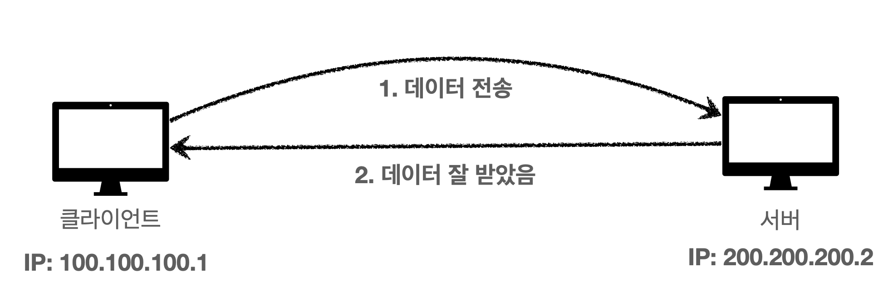
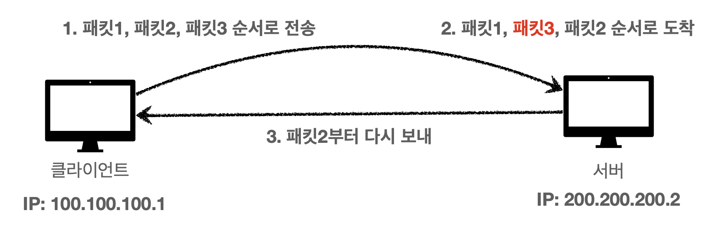

# 모든 개발자를 위한 HTTP 웹 기본 지식 - 김영한

## Section 1. 인터넷 네트워크
    [요약]
    - 인터넷 통신
    - IP (Internet Protocol)
    - TCP, UDP
    - Port
    - DNS

### 인터넷 통신
인터넷은 복잡한 노드들로 이루어져 있다.

---
### IP (Internet Protocol)
    [역할]
    - 지정한 IP 주소(IP Address)에 데이터 전달
    - 패킷(Packet)이라는 통신단위로 데이터 전달

IP 패킷 정보
: 출발지IP, 도착지IP, 전송할 데이터 등

서버 패킷 전달
인터넷 망이 복잡하기 때문에 `요청을 보냈을 때`와 `응답을 받을 때` 다른 루트를 통해서 패킷이 이동할 수 있다.

#### IP 프로토콜의 한계
- 비연결성 : 패킷을 받을 대상이 없거나 서비스 불능 상태여도 패킷은 전송됨.
- 비신뢰성
    - 중간에 패킷 소실
    - 패킷 전달 순서 문제 발생
- 프로그램 구분 : 같은 IP로 여러개의 애플리케이션이 실행중이라면?
---
### TCP, UDP
#### 인터넷 프로토콜의 4계층

프로토콜 계층

    1. 애플리케이션의 'Socket Library'가 전송할 데이터를 OS단의 TCP(전송 계층)로 전달.
    2. 데이터를 TCP 정보가 포함된 포장지(?)로 감싼 뒤에 IP계층(인터넷 계층)로 전달.
    3. IP단에서는 전달받은 데이터에 IP 데이터를 포함한 포장지(?)로 한번 더 감싼 뒤 '네트워크 인터페이스'로 전달.
    4. '네트워크 인터페이스'에서는 'Ethernet Frame'이라는 포장지(?)로 한번 더 감싸고 인터넷을 통해 전송된다.

> 패킷(Packet) = 수화물(Package) + 바구니(Bucket)

#### TCP/IP 패킷 정보
TCP segment = 출발지 Port + 도착지 Port + 전송제어 + 전송순서 + 검증 정보 + ...

#### TCP(Transmission Control Protocol) 특징
- 연결지향(3 Way Handshake) : 연결 확인을 하고 데이터를 보냄. -> 논리적으로만(물리적 X) 연결된 것. (가상연결)
- 데이터 전달 보증 : 데이터 누락을 알 수 있음.
- 순서 보장
- `신뢰할 수 있는` 프로토콜
- 현재는 대부분의 애플리케이션에서 TCP를 사용함.

**[3 Way Handshake]**

`SYN = Synchronize / ACK = Acknowledge`

**[데이터 전달 보증]**

**[순서 보장]**

#### UDP(User Datagram Protocol) 특징
- 기능이 거의 없음.
- IP와 거의 똑같음. 대신 `PORT와 체크썸` 정도만 추가.
- 데이터 전달 및 순서가 보장되지는 않지만 `단순하고 빠름.`

